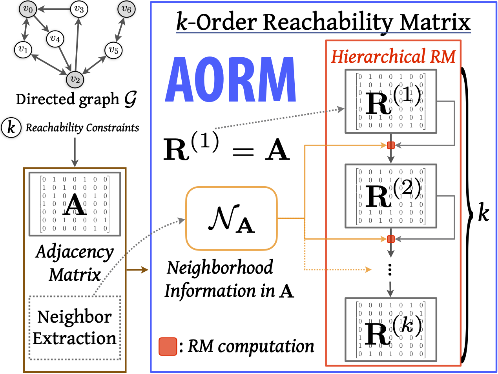

# AORM: Arbitrary-Order Reachability Matrix

This folder contains the code and data of our AORM framework.



## Folder structure:

* datasets: including synthetic and real-world dataset used in our experiments
	* real-world networks are available at [Stanford SNAP datsets](http://snap.stanford.edu/data/index.html) and [The Network Repository](http://networkrepository.com/).

## Requirements

Python 3.7, Numpy 1.16.3, argparse and so on. (refer to requirements.txt)

```
pip install -r requirements.txt
```

## Run

### Basic arguments
```
$ python main.py --help
usage: main.py [-h] [-m [M]] [-i [I]] [-p P] [-k [K]] [-r R] [-d D]

AORM: Arbitrary-order reachability matrix framework

optional arguments:
  -h, --help  show this help message and exit
  -m [M]      Methods (i: I-AORM, m: M-AORM, v: V-BFS, x: NetworkX, p: P-SM)
  -i [I]      Input graph file path
  -p P        Incremental computations per step unit
  -k [K]      Reachability constraints (k-order)
  -r R        Real-world network experiment
  -d D        Directed (True) or undirected (False)
```

### Synthetic networks
#### P-SM
```
python main.py -m p -i ./datasets/synthetic/ba_graph_n500.gpickle
```
#### NetworkX
```
python main.py -m x -i ./datasets/synthetic/ba_graph_n500.gpickle
```
#### V-BFS
```
python main.py -m v -i ./datasets/synthetic/ba_graph_n500.gpickle
```
#### M-AORM
```
python main.py -m m -i ./datasets/synthetic/ba_graph_n500.gpickle
```
#### I-AORM
```
python main.py -m i -i ./datasets/synthetic/ba_graph_n500.gpickle
```

### Real-world networks

#### P-SM
```
python main.py -m p -r True -i ./datasets/real-world/facebook_combined.txt
```
#### NetworkX
```
python main.py -m x -r True -i ./datasets/real-world/facebook_combined.txt
```
#### V-BFS
```
python main.py -m v -r True -i ./datasets/real-world/facebook_combined.txt
```
#### M-AORM
```
python main.py -m m -r True -i ./datasets/real-world/facebook_combined.txt
```
#### I-AORM
```
python main.py -m i -r True -i ./datasets/real-world/facebook_combined.txt
```
